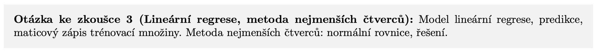

# My notes for last exam

## Abstract

This document [my_ml1_notes_staifmatej.pdf](my_ml1_notes_staifmatej.pdf) is collection of notes in Czech language for preparation for exam from subject Machine Learning 1 (BI-ML1) at CTU FIT (winter semester 2025/26). The text is synthesis of information presented at lectures, but I created it independently by myself. I declare that the text itself was not generated using LLM. In case you find any errors please use issues or contact in the header of document.

## Notice
- In each section is marked and highlighted under the heading which question for oral exam the chapter belongs to! This way I processed all questions for oral exam.

- In my notes I added under chapters a chapter with title: *"Zajímavá videa na YouTube"*, where I added links to interesting videos on youtube. These are videos which helped me myself understand the material more in depth and maybe also more intuitively, and therefore I recommend these videos also to kind reader.
- Into second to last chapter with title: *"Zajímavá videa na YouTube přesahující rámec kurzu"* I added links to interesting videos on youtube which go beyond scope of course (or belong to follow-up summer course Machine Learning 2), but they are really super and belong among my favorite videos and maybe it also helps someone else to expand their horizons.
- Last chapter contains summary of all formulas which are in my opinion crucial for passing oral exam. It is not summary for memorizing all needed formulas, but rather for such quick look and check that kind reader can derive every formula.
